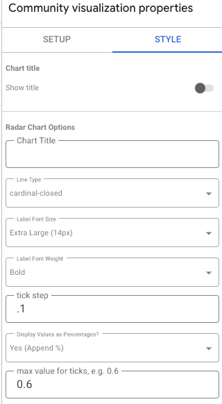

# Looker Community Visualization - Radar Charts

A Looker Studio community visualization component for Radar Charts. Adapted from (Observable)[https://observablehq.com/@observablehq/plot-radar-chart].

Working demo: https://lookerstudio.google.com/reporting/830f64a2-39e4-4744-95ab-9e3f56d12642


## Features

- Interactive radar chart
- Hover over different values
- Responsive design with modern CSS

## Development Setup

### Prerequisites

- Node.js > 18
- npm
- Google Cloud Platform account (for deployment)
- Vite for dev and bundling

### Local Development

1. Clone the repository
2. Install dependencies:
```bash
npm install
```

3. Start the development server:
```bash
npm run dev
```

### Project Structure

```
├── data/                  # Sample data files (ignored by git)
│   └── phones.csv        # Sample data for local development
├── public/               # Static assets
│   ├── index.css
│   └── manifest.json
├── src/                 # Source code
│   ├── index.css
│   ├── index.js          # Main visualization code
│   ├── radar.js          # Radar chart implementation
│   └── resize.js         # Responsive handling
├── package.json
├── vite.config.js
├── upload_to_gcp.template.sh # Template deployment script
└── upload_to_gcp.sh          # Your private deployment script (git-ignored)
```

### Configuration and Deployment

1. Copy the template deployment script:
```bash
cp upload_to_gcp.template.sh upload_to_gcp.sh
chmod +x upload_to_gcp.sh
```

2. Edit `upload_to_gcp.sh` with your specific settings or set environment variables:

You can either:
- Edit the default values directly in the script:
  ```bash
  GCP_ACCOUNT=${GCP_ACCOUNT:-"your-account@example.com"}
  GCP_PROJECT=${GCP_PROJECT:-"your-project-id"}
  GCP_BUCKET=${GCP_BUCKET:-"gs://your-bucket/radar-chart"}
  ```

- Or set environment variables before running the script:
  ```bash
  export GCP_ACCOUNT="your-account@example.com"
  export GCP_PROJECT="your-project-id" 
  export GCP_BUCKET="gs://your-bucket/radar-chart"
  ./upload_to_gcp.sh
  ```

> **Note:** The `upload_to_gcp.sh` file is excluded from git to prevent sharing your private credentials.

### Building and Deploying

To build and deploy in one step, just run:

```bash
./upload_to_gcp.sh
```

This will:
1. Build the project with `npm run build`
2. Set the appropriate GCP project and account
3. Upload the files to your GCP bucket

For local testing, modify the sample data paths directly in the `src/index.js` file if needed.

## In Looker Studio

Add the custom viz in the form `gs://BUCKET/FOLDER` - just as you entered it in `./upload_to_gcp.sh`

## Dependencies

- @observablehq/plot: Data visualization library
- @observablehq/inputs: Input components
- d3-dsv: CSV parsing (only needed for local dev)
- htl: HTML templating
- @google/dscc: Looker Studio community visualization SDK

## Local Testing

Place your sample data in the `/data` directory as CSV files. The application will try to load from paths specified in your `config.js` file under `local.sampleDataPaths`.

By default, it will check:
```
./data/phones.csv
../data/phones.csv
/data/phones.csv
```

When running with `npm run dev`, the application automatically sets the `LOCAL` flag to true.

### Sample Data Format

Your CSV file should include:
- A `name` column for each data series (e.g., "Phone Model 1")
- Additional columns for each metric/axis (e.g., "Battery", "Camera", "Speed")

Example:
```csv
name,Battery,Camera,Speed,RAM,Storage
Phone Model 1,0.8,0.7,0.6,0.9,0.5
Phone Model 2,0.6,0.9,0.7,0.8,0.4
```

## Configuration

The visualization has a few customization options:



## License

MIT
